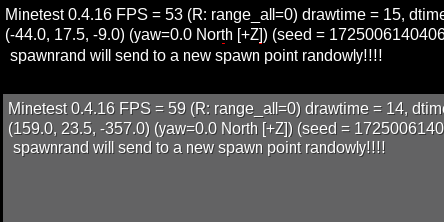

minetest mod spawnrand
======================

SPAWN random on each respawn of player

## Information
-----------

This mod is named `spawnrand` and changes spawn point on each respawn
is a mod for random respawn to new point of spawn for each player 
no matter what rules.

## Technical info
-------------

This mod has an improved way to do not hand server if no valild spawn point 
is found in some minutes.. cos all spawn managers in minetest causes problems 
when players joins.

This mod is a derived work from the original Nathan Salapat's "random_spawn" 
that is pretty unmantained or staled. We provided a end of the search for 
points nodes of valid spawns.. validations of players connection and limited area 
to search nodes for spawns. It not check if area is protected.

For more advanced spawn management use the "rspawn" mod from minenux 
or taidkez's rspawn original work.

#### Depends

* beds as optional

#### Configuration

It will send a chat notificatin private message to the player about new spawn position, 
is configurable with `spawnrand.notification_position` boolean value with defaults as `true`.

License
------

CC BY-NC-SA 4.0

Attribution-NonCommercial-ShareAlike 4.0 International

(C) 2021-2022 PICCORO Lenz McKAY
(C) 2017-2020 Nathan Salapat

The above copyright notice and this permission notice 
shall be included in all copies or substantial portions of the Software.

[license.txt](license.txt)

